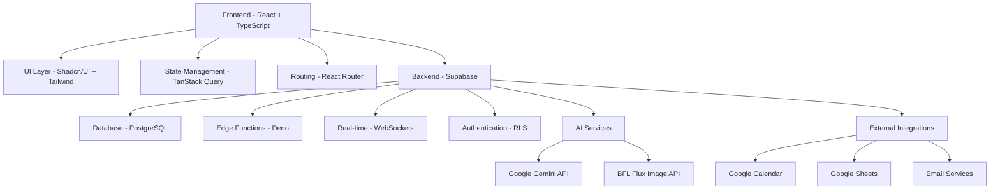
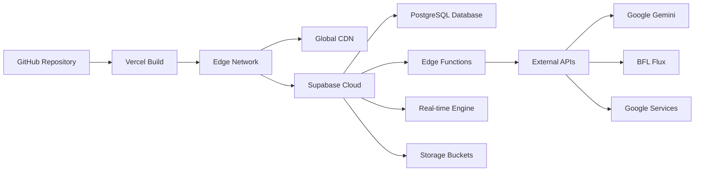
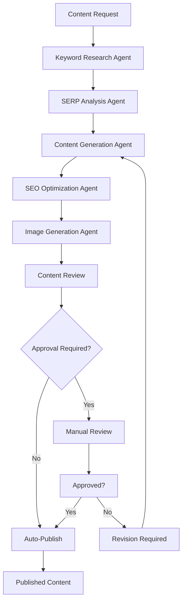

# 🚀 Agentic AI Application - Complete System Documentation

> **The Ultimate Guide to Understanding the Agentic AI Platform**  
> *A comprehensive, detailed documentation of the entire application architecture, workflows, and functionalities*

---

## 📋 Table of Contents

1. [🌟 Executive Overview](#-executive-overview)
2. [🏗️ System Architecture](#️-system-architecture)
3. [🎯 Frontend Architecture](#-frontend-architecture)
4. [⚡ Backend & API Systems](#-backend--api-systems)
5. [🗄️ Database Schema & Management](#️-database-schema--management)
6. [🤖 AI Integration & Workflows](#-ai-integration--workflows)
7. [🔐 Security & Authentication](#-security--authentication)
8. [📱 User Interface Components](#-user-interface-components)
9. [🌊 Data Flow & State Management](#-data-flow--state-management)
10. [🚀 Deployment & Infrastructure](#-deployment--infrastructure)
11. [🔧 Development Workflow](#-development-workflow)
12. [📊 Analytics & Monitoring](#-analytics--monitoring)

---

## 🌟 Executive Overview

### What is Agentic AI?

**Agentic AI** is a cutting-edge, enterprise-grade platform designed to revolutionize business automation through autonomous AI agents. This comprehensive web application serves as the complete digital presence for Agentic AI Ltd, combining:

- **🎯 Marketing Website**: Professional showcase of AI automation services
- **🤖 AI-Powered Content Generation**: Advanced content creation using Google Gemini API
- **📊 Admin Dashboard**: Sophisticated management interface with real-time analytics
- **💼 Business Intelligence**: Meeting scheduling, contact management, and ROI calculations
- **📧 Communication Hub**: Newsletter management and client interaction systems

### Core Value Proposition

The platform transforms traditional business operations by:
- **Automating Complex Workflows** with intelligent AI agents
- **Generating High-Quality Content** at scale using advanced AI models
- **Providing Real-Time Business Intelligence** through interactive dashboards
- **Streamlining Client Interactions** with automated meeting scheduling and contact management
- **Delivering Measurable ROI** through built-in calculation and tracking tools

---

## 🏗️ System Architecture

### Technology Stack Overview



### Core Components Breakdown

| Layer | Technology | Purpose | Key Features |
|-------|------------|---------|--------------|
| **Frontend** | React 18 + TypeScript | User Interface | Type-safe, component-based, reactive |
| **UI Framework** | Shadcn/UI + Tailwind CSS | Design System | Accessible, customizable, responsive |
| **Backend** | Supabase | Database & API | Real-time, scalable, secure |
| **AI Engine** | Google Gemini 2.0 Flash | Content Generation | Advanced language model |
| **Image AI** | BFL Flux Kontext Pro | Visual Content | High-quality image generation |
| **Deployment** | Vercel | Hosting Platform | Edge computing, auto-scaling |

---

## 🎯 Frontend Architecture

### Application Structure

```
src/
├── 📁 components/           # Reusable UI components
│   ├── Navigation.tsx       # Main navigation bar with contact info
│   ├── Footer.tsx          # Footer with company details & LinkedIn
│   ├── Chatbot.tsx         # AI-powered chat interface
│   ├── MeetingBookingModal.tsx # Meeting scheduling component
│   └── ui/                 # Shadcn/UI component library
├── 📁 pages/               # Route-based page components
│   ├── Index.tsx           # Homepage with hero & services
│   ├── About.tsx           # Company information
│   ├── Services.tsx        # Service offerings overview
│   ├── CaseStudies.tsx     # Success stories & case studies
│   ├── Resources.tsx       # Knowledge base & resources
│   ├── Blog.tsx            # AI-generated blog content
│   ├── Contact.tsx         # Contact form & information
│   ├── ROICalculator.tsx   # Interactive ROI calculator
│   └── admin/              # Admin dashboard pages
├── 📁 hooks/               # Custom React hooks
│   ├── useContent.tsx      # Content management
│   ├── useMeetingScheduler.tsx # Meeting functionality
│   └── useNewsletter.tsx   # Newsletter management
├── 📁 integrations/        # External API integrations
│   └── supabase/          # Supabase client configuration
└── 📁 lib/                # Utility functions & configurations
```

### Key Frontend Features

#### 🎨 Modern UI/UX Design
- **Glassmorphism Effects**: Modern card designs with blur effects
- **Dark Theme**: Professional dark mode with purple/blue gradients
- **Responsive Design**: Mobile-first approach with breakpoint optimization
- **Interactive Elements**: Smooth animations and micro-interactions
- **Accessibility**: WCAG 2.1 compliant components

#### 🔄 State Management
- **TanStack Query**: Server state management with caching
- **React Context**: Global state for authentication and theme
- **Local Storage**: Persistent user preferences
- **Real-time Updates**: Live data synchronization with Supabase

#### 🚀 Performance Optimizations
- **Code Splitting**: Lazy loading of route components
- **Image Optimization**: WebP format with fallbacks
- **Bundle Analysis**: Minimized JavaScript payload
- **Caching Strategies**: Intelligent API response caching

---

## ⚡ Backend & API Systems

### Supabase Edge Functions Architecture

The backend consists of multiple specialized Edge Functions, each handling specific business logic:

```typescript
// Function Structure Example
supabase/functions/
├── 📄 content-generator-agent/     # AI content generation
├── 📄 chatbot-agent/              # Chatbot interactions
├── 📄 meeting-scheduler/          # Meeting management
├── 📄 newsletter-subscription/    # Newsletter handling
├── 📄 contact-manager/           # Contact form processing
├── 📄 resource-generator/        # Resource creation
├── 📄 image-generator-agent/     # Image generation
├── 📄 keyword-research-agent/    # SEO keyword analysis
├── 📄 seo-generator-agent/       # SEO optimization
├── 📄 serp-analysis-agent/       # Search result analysis
└── 📄 google-integrations/       # Calendar & Sheets
```

### Core API Functionalities

#### 🤖 Content Generation System
```typescript
interface ContentRequest {
  requestId: string;
  contentType: 'blog' | 'page' | 'service' | 'resource';
  targetKeywords: string[];
  customInstructions?: string;
  contentLength: '1500+' | '2500+' | '3000+' | '5000+';
  seoFocus: boolean;
  brandAwareness: boolean;
}

// Workflow Process:
// 1. Keyword Research → AI analyzes target keywords
// 2. SERP Analysis → Competitor content analysis
// 3. Content Generation → Gemini creates optimized content
// 4. SEO Optimization → Meta tags, headings, structure
// 5. Image Generation → Custom visuals using BFL Flux
// 6. Content Publishing → Save to database with metadata
```

#### 📅 Meeting Scheduling System
```typescript
interface MeetingRequest {
  clientName: string;
  clientEmail: string;
  serviceType: string;
  preferredDate: Date;
  timeSlot: string;
  duration: number;
  notes?: string;
}

// Features:
// - Google Calendar integration
// - Automated email confirmations
// - Time zone handling
// - Conflict detection
// - Reminder notifications
```

#### 📧 Communication Hub
```typescript
interface NewsletterSubscription {
  email: string;
  source: string;
  tags: string[];
  preferences: {
    frequency: 'weekly' | 'monthly';
    topics: string[];
  };
}

// Capabilities:
// - Email validation & verification
// - Subscription management
// - Campaign tracking
// - Unsubscribe handling
// - Analytics reporting
```

---

## 🗄️ Database Schema & Management

### PostgreSQL Database Structure

The application uses a sophisticated PostgreSQL database with the following key tables:

#### Core Business Tables

```sql
-- Contact Management
CREATE TABLE contact_submissions (
    id UUID PRIMARY KEY DEFAULT gen_random_uuid(),
    name VARCHAR(255) NOT NULL,
    email VARCHAR(255) NOT NULL,
    company VARCHAR(255),
    phone VARCHAR(50),
    service VARCHAR(255),
    budget VARCHAR(100),
    message TEXT NOT NULL,
    status VARCHAR(50) DEFAULT 'new',
    admin_notes TEXT,
    created_at TIMESTAMP WITH TIME ZONE DEFAULT NOW(),
    updated_at TIMESTAMP WITH TIME ZONE DEFAULT NOW()
);

-- Content Generation Tracking
CREATE TABLE content_requests (
    id UUID PRIMARY KEY DEFAULT gen_random_uuid(),
    request_id VARCHAR(255) UNIQUE NOT NULL,
    content_type VARCHAR(100) NOT NULL,
    target_keywords TEXT[] NOT NULL,
    status VARCHAR(50) DEFAULT 'pending',
    progress JSONB DEFAULT '{}',
    generated_content JSONB,
    metadata JSONB DEFAULT '{}',
    created_at TIMESTAMP WITH TIME ZONE DEFAULT NOW(),
    completed_at TIMESTAMP WITH TIME ZONE
);

-- Meeting Scheduling
CREATE TABLE meetings (
    id UUID PRIMARY KEY DEFAULT gen_random_uuid(),
    client_name VARCHAR(255) NOT NULL,
    client_email VARCHAR(255) NOT NULL,
    meeting_date TIMESTAMP WITH TIME ZONE NOT NULL,
    duration INTEGER DEFAULT 60,
    service_type VARCHAR(255),
    status VARCHAR(50) DEFAULT 'scheduled',
    google_event_id VARCHAR(255),
    notes TEXT,
    created_at TIMESTAMP WITH TIME ZONE DEFAULT NOW()
);

-- Newsletter Management
CREATE TABLE newsletter_subscriptions (
    id UUID PRIMARY KEY DEFAULT gen_random_uuid(),
    email VARCHAR(255) UNIQUE NOT NULL,
    subscription_date TIMESTAMP WITH TIME ZONE DEFAULT NOW(),
    source VARCHAR(100),
    tags TEXT[] DEFAULT '{}',
    status VARCHAR(50) DEFAULT 'active',
    preferences JSONB DEFAULT '{}'
);
```

#### Advanced Features

**🔐 Row Level Security (RLS)**
```sql
-- Example RLS Policy
CREATE POLICY "Admin access to contact submissions" 
ON contact_submissions FOR ALL 
USING (auth.role() = 'authenticated');

CREATE POLICY "Public contact form submissions" 
ON contact_submissions FOR INSERT 
WITH CHECK (true);
```

**📊 Analytics & Logging**
```sql
-- API Usage Tracking
CREATE TABLE api_usage_logs (
    id UUID PRIMARY KEY DEFAULT gen_random_uuid(),
    function_name VARCHAR(255) NOT NULL,
    request_data JSONB,
    response_status INTEGER,
    execution_time_ms INTEGER,
    tokens_used INTEGER,
    cost_usd DECIMAL(10,6),
    created_at TIMESTAMP WITH TIME ZONE DEFAULT NOW()
);

-- Email Delivery Logs
CREATE TABLE email_logs (
    id UUID PRIMARY KEY DEFAULT gen_random_uuid(),
    recipient_email VARCHAR(255) NOT NULL,
    email_type VARCHAR(100) NOT NULL,
    status VARCHAR(50) NOT NULL,
    error_message TEXT,
    sent_at TIMESTAMP WITH TIME ZONE DEFAULT NOW()
);
```

---

## 🤖 AI Integration & Workflows

### Google Gemini Integration

The application leverages Google Gemini 2.0 Flash Exp for advanced content generation:

```typescript
// Content Generation Workflow
class ContentGenerationAgent {
  async generateContent(request: ContentRequest): Promise<GeneratedContent> {
    // Step 1: Keyword Research
    const keywordAnalysis = await this.analyzeKeywords(request.targetKeywords);
    
    // Step 2: SERP Analysis
    const competitorAnalysis = await this.analyzeSERP(request.targetKeywords);
    
    // Step 3: Content Outline Creation
    const outline = await this.createOutline(keywordAnalysis, competitorAnalysis);
    
    // Step 4: Content Generation
    const content = await this.generateMainContent(outline, request);
    
    // Step 5: SEO Optimization
    const optimizedContent = await this.optimizeForSEO(content, keywordAnalysis);
    
    // Step 6: Image Generation (if requested)
    if (request.includeImages) {
      optimizedContent.images = await this.generateImages(content);
    }
    
    return optimizedContent;
  }
}
```

### AI Prompt Engineering

The system uses sophisticated prompt engineering techniques:

```typescript
const CONTENT_GENERATION_PROMPT = `
You are an expert content creator specializing in AI automation and business transformation.

Context:
- Company: Agentic AI Ltd (agentic-ai.ltd)
- Industry: AI Automation Services
- Target Audience: Enterprise decision-makers, CTOs, Business Leaders
- Brand Voice: Professional, innovative, trustworthy, forward-thinking

Task: Create ${contentType} content optimized for the following keywords: ${keywords.join(', ')}

Requirements:
- Length: ${contentLength} words minimum
- SEO Focus: ${seoFocus ? 'High' : 'Medium'}
- Brand Integration: ${brandAwareness ? 'Include company references' : 'Generic industry content'}
- Tone: Professional yet approachable
- Structure: Clear headings, bullet points, actionable insights

Content Guidelines:
1. Start with a compelling hook that addresses the reader's pain points
2. Provide valuable, actionable insights
3. Include real-world examples and case studies where appropriate
4. End with a clear call-to-action
5. Naturally integrate target keywords without keyword stuffing
6. Use data and statistics to support claims
7. Address common objections and concerns

Output Format: Markdown with proper heading structure (H1, H2, H3)
`;
```

### Image Generation with BFL Flux

```typescript
interface ImageGenerationRequest {
  prompt: string;
  style: 'professional' | 'modern' | 'corporate' | 'technical';
  dimensions: '1024x1024' | '1920x1080' | '1080x1920';
  brandColors?: string[];
}

// Advanced image prompts for business content
const generateImagePrompt = (contentTitle: string, style: string) => `
Create a professional, modern ${style} image for business content titled "${contentTitle}".

Style Requirements:
- Clean, minimalist design
- Corporate color palette (blues, grays, whites)
- Modern technology aesthetic
- No text overlays
- High contrast and clarity
- Suitable for web and print use

Visual Elements:
- Abstract technology patterns
- Geometric shapes
- Subtle gradients
- Professional lighting
- Clean composition
`;
```

---

## 🔐 Security & Authentication

### Multi-Layer Security Architecture

#### 🛡️ Authentication System
```typescript
// Admin Authentication Flow
interface AdminCredentials {
  email: string;
  password: string;
}

// Authentication States
type AuthState = 'authenticated' | 'unauthenticated' | 'loading';

// Security Features:
// - JWT token-based authentication
// - Session persistence with secure storage
// - Automatic token refresh
// - Role-based access control (RBAC)
// - Multi-factor authentication ready
```

#### 🔒 Data Protection
```typescript
// Environment Variable Security
const SECURE_ENV_VARS = {
  GEMINI_API_KEY: process.env.GEMINI_API_KEY,
  BFL_FLUX_API_KEY: process.env.BFL_FLUX_API_KEY,
  SUPABASE_SERVICE_ROLE_KEY: process.env.SUPABASE_SERVICE_ROLE_KEY,
  ADMIN_EMAIL: process.env.ADMIN_EMAIL,
  ADMIN_PASSWORD_HASH: process.env.ADMIN_PASSWORD_HASH
};

// Security Measures:
// - API keys stored in Supabase Vault
// - Environment variables encrypted at rest
// - HTTPS enforcement across all endpoints
// - CORS policies properly configured
// - SQL injection protection through parameterized queries
```

#### 🚨 Monitoring & Audit Logging
```sql
-- Security Audit Log
CREATE TABLE security_audit_log (
    id UUID PRIMARY KEY DEFAULT gen_random_uuid(),
    event_type VARCHAR(100) NOT NULL,
    user_email VARCHAR(255),
    ip_address INET,
    user_agent TEXT,
    request_data JSONB,
    success BOOLEAN NOT NULL,
    error_message TEXT,
    created_at TIMESTAMP WITH TIME ZONE DEFAULT NOW()
);
```

---

## 📱 User Interface Components

### Component Architecture

The UI is built using a modular component system with Shadcn/UI as the foundation:

#### 🏠 Navigation Component
```typescript
// Navigation.tsx - Enhanced with contact information
interface NavigationProps {
  variant?: 'default' | 'transparent';
}

const Navigation: React.FC<NavigationProps> = ({ variant = 'default' }) => {
  return (
    <nav className="sticky top-0 z-50 w-full">
      {/* Top Contact Bar */}
      <div className="border-b border-border/40 bg-muted/20">
        <div className="container mx-auto px-4">
          <div className="flex justify-end items-center py-2 space-x-6">
            <ContactInfo />
            <SocialLinks />
          </div>
        </div>
      </div>
      
      {/* Main Navigation */}
      <MainNavigation />
    </nav>
  );
};

// Features:
// - Contact information display (email, phone)
// - LinkedIn social integration
// - Responsive mobile menu
// - Active route highlighting
// - Dropdown service menus
// - Meeting booking integration
```

#### 🎯 Enhanced Hero Section
```typescript
// EnhancedHero.tsx - Dynamic homepage hero
interface HeroProps {
  badge: string;
  title: string;
  subtitle: string;
  description: string;
  primaryAction: {
    text: string;
    onClick: () => void;
  };
  secondaryAction: {
    text: string;
    onClick: () => void;
  };
  stats: Array<{
    value: string;
    label: string;
  }>;
}

// Interactive Features:
// - Animated statistics counters
// - Parallax background effects
// - Call-to-action buttons
// - Video background support
// - Mobile-optimized layout
```

#### 📊 Admin Dashboard Components
```typescript
// AdminDashboard.tsx - Real-time analytics
const AdminDashboard = () => {
  const [metrics, setMetrics] = useState<DashboardMetrics>();
  const [realTimeData, setRealTimeData] = useState<RealTimeUpdate[]>([]);
  
  // Real-time subscription to data changes
  useEffect(() => {
    const subscription = supabase
      .channel('dashboard-updates')
      .on('postgres_changes', {
        event: '*',
        schema: 'public',
        table: 'content_requests'
      }, handleRealTimeUpdate)
      .subscribe();
      
    return () => subscription.unsubscribe();
  }, []);
  
  return (
    <div className="space-y-6">
      <StatisticsCards metrics={metrics} />
      <RealTimeActivityFeed updates={realTimeData} />
      <ContentGenerationProgress />
      <RecentContacts />
    </div>
  );
};
```

### UI Component Library

| Component Category | Components | Purpose |
|-------------------|------------|---------|
| **Layout** | Navigation, Footer, AdminLayout | Application structure |
| **Forms** | ContactForm, MeetingBooking, Newsletter | User input collection |
| **Data Display** | Cards, Tables, Charts, Statistics | Information presentation |
| **Feedback** | Toasts, Alerts, Loading States | User feedback |
| **Interactive** | Buttons, Modals, Dropdowns | User interactions |
| **Specialized** | Chatbot, ROICalculator, ContentGenerator | Business-specific functionality |

---

## 🌊 Data Flow & State Management

### Frontend State Architecture

```typescript
// Global State Management with TanStack Query
const QueryClient = new QueryClient({
  defaultOptions: {
    queries: {
      staleTime: 5 * 60 * 1000, // 5 minutes
      cacheTime: 10 * 60 * 1000, // 10 minutes
      refetchOnWindowFocus: false,
      retry: 3,
    },
  },
});

// State Categories:
// 1. Server State (TanStack Query)
//    - API data caching
//    - Background refetching
//    - Optimistic updates
//    - Error handling

// 2. Client State (React Context)
//    - Authentication status
//    - Theme preferences
//    - UI state (modals, drawers)
//    - Form state

// 3. Local State (Component State)
//    - Component-specific state
//    - Form inputs
//    - Loading states
//    - Error messages
```

### Real-Time Data Synchronization

```typescript
// Real-time Supabase Integration
const useRealTimeData = (table: string, filters?: any) => {
  const [data, setData] = useState([]);
  
  useEffect(() => {
    // Initial data fetch
    const fetchInitialData = async () => {
      const { data: initialData } = await supabase
        .from(table)
        .select('*')
        .match(filters || {});
      setData(initialData || []);
    };
    
    fetchInitialData();
    
    // Real-time subscription
    const subscription = supabase
      .channel(`${table}-changes`)
      .on('postgres_changes', {
        event: '*',
        schema: 'public',
        table: table,
        filter: filters ? Object.entries(filters)
          .map(([key, value]) => `${key}=eq.${value}`)
          .join(',') : undefined
      }, (payload) => {
        handleRealTimeUpdate(payload);
      })
      .subscribe();
      
    return () => subscription.unsubscribe();
  }, [table, filters]);
  
  return data;
};
```

### API Integration Patterns

```typescript
// Custom Hooks for API Integration
export const useContentGeneration = () => {
  const mutation = useMutation({
    mutationFn: async (request: ContentRequest) => {
      const response = await supabase.functions.invoke('content-generator-agent', {
        body: request
      });
      return response.data;
    },
    onSuccess: (data) => {
      // Invalidate and refetch relevant queries
      queryClient.invalidateQueries({ queryKey: ['content-requests'] });
      
      // Show success notification
      toast.success('Content generation started successfully!');
    },
    onError: (error) => {
      console.error('Content generation failed:', error);
      toast.error('Failed to start content generation. Please try again.');
    }
  });
  
  return mutation;
};

// Meeting Scheduling Hook
export const useMeetingScheduler = () => {
  const createMeeting = useMutation({
    mutationFn: async (meeting: MeetingRequest) => {
      const response = await supabase.functions.invoke('meeting-scheduler', {
        body: meeting
      });
      return response.data;
    },
    onSuccess: () => {
      queryClient.invalidateQueries({ queryKey: ['meetings'] });
      toast.success('Meeting scheduled successfully!');
    }
  });
  
  const getMeetings = useQuery({
    queryKey: ['meetings'],
    queryFn: async () => {
      const { data } = await supabase
        .from('meetings')
        .select('*')
        .order('meeting_date', { ascending: true });
      return data;
    }
  });
  
  return { createMeeting, getMeetings };
};
```

---

## 🚀 Deployment & Infrastructure

### Deployment Architecture



### Environment Configuration

```bash
# Production Environment Variables
VITE_SUPABASE_URL=https://your-project.supabase.co
VITE_SUPABASE_ANON_KEY=your_anon_key

# Supabase Secrets (Server-side)
GEMINI_API_KEY=your_gemini_api_key
BFL_FLUX_API_KEY=your_bfl_api_key
ADMIN_EMAIL=info@agentic-ai.ltd
ADMIN_PASSWORD_HASH=bcrypt_hashed_password

# Google Integration
GOOGLE_CLIENT_ID=your_google_client_id
GOOGLE_CLIENT_SECRET=your_google_client_secret
GOOGLE_CALENDAR_API_KEY=your_calendar_api_key

# Email Configuration
SMTP_HOST=smtp.siteground.com
SMTP_PORT=587
SMTP_USER=your_email@agentic-ai.ltd
SMTP_PASSWORD=your_email_password
```

### Scalability Considerations

#### 🔄 Auto-Scaling Features
- **Vercel Edge Functions**: Automatic scaling based on traffic
- **Supabase Auto-scaling**: Database connections and compute resources
- **CDN Distribution**: Global content delivery for optimal performance
- **Caching Strategies**: Multi-layer caching for reduced API calls

#### 📊 Performance Monitoring
```typescript
// Performance Tracking
const trackPerformance = (operation: string, startTime: number) => {
  const endTime = performance.now();
  const duration = endTime - startTime;
  
  // Log to analytics
  supabase.from('performance_logs').insert({
    operation,
    duration_ms: duration,
    timestamp: new Date().toISOString(),
    user_agent: navigator.userAgent
  });
};

// Usage Example
const startTime = performance.now();
await generateContent(request);
trackPerformance('content_generation', startTime);
```

---

## 🔧 Development Workflow

### Development Environment Setup

```bash
# 1. Clone Repository
git clone https://github.com/your-repo/agentic-ai-platform.git
cd agentic-ai-platform

# 2. Install Dependencies
npm install

# 3. Environment Configuration
cp .env.example .env.local
# Edit .env.local with your API keys

# 4. Database Setup
npx supabase login
npx supabase link --project-ref your-project-ref
npx supabase db reset

# 5. Function Deployment
npx supabase functions deploy

# 6. Start Development Server
npm run dev
```

### Code Quality & Standards

#### 🎯 TypeScript Configuration
```json
{
  "compilerOptions": {
    "target": "ES2020",
    "lib": ["ES2020", "DOM", "DOM.Iterable"],
    "module": "ESNext",
    "skipLibCheck": true,
    "moduleResolution": "bundler",
    "allowImportingTsExtensions": true,
    "resolveJsonModule": true,
    "isolatedModules": true,
    "noEmit": true,
    "jsx": "react-jsx",
    "strict": true,
    "noUnusedLocals": true,
    "noUnusedParameters": true,
    "noFallthroughCasesInSwitch": true
  }
}
```

#### 🧹 ESLint Configuration
```javascript
module.exports = {
  root: true,
  env: { browser: true, es2020: true },
  extends: [
    'eslint:recommended',
    '@typescript-eslint/recommended',
    'plugin:react-hooks/recommended',
  ],
  ignorePatterns: ['dist', '.eslintrc.cjs'],
  parser: '@typescript-eslint/parser',
  plugins: ['react-refresh'],
  rules: {
    'react-refresh/only-export-components': [
      'warn',
      { allowConstantExport: true },
    ],
    '@typescript-eslint/no-unused-vars': 'error',
    'prefer-const': 'error',
    'no-var': 'error'
  },
};
```

### Testing Strategy

```typescript
// Unit Testing Example
import { render, screen, fireEvent, waitFor } from '@testing-library/react';
import { QueryClient, QueryClientProvider } from '@tanstack/react-query';
import { ContentGenerator } from '../ContentGenerator';

describe('ContentGenerator', () => {
  let queryClient: QueryClient;

  beforeEach(() => {
    queryClient = new QueryClient({
      defaultOptions: {
        queries: { retry: false },
        mutations: { retry: false },
      },
    });
  });

  it('should generate content successfully', async () => {
    render(
      <QueryClientProvider client={queryClient}>
        <ContentGenerator />
      </QueryClientProvider>
    );

    const generateButton = screen.getByText('Generate Content');
    fireEvent.click(generateButton);

    await waitFor(() => {
      expect(screen.getByText('Content generated successfully!')).toBeInTheDocument();
    });
  });
});

// Integration Testing
describe('API Integration', () => {
  it('should handle content generation workflow', async () => {
    const request = {
      contentType: 'blog',
      targetKeywords: ['AI automation', 'business transformation'],
      contentLength: '2500+',
      seoFocus: true,
      brandAwareness: true
    };

    const response = await fetch('/api/content-generator', {
      method: 'POST',
      headers: { 'Content-Type': 'application/json' },
      body: JSON.stringify(request)
    });

    expect(response.status).toBe(200);
    const data = await response.json();
    expect(data.status).toBe('success');
  });
});
```

---

## 📊 Analytics & Monitoring

### Performance Metrics

#### 🎯 Key Performance Indicators (KPIs)
```typescript
interface ApplicationMetrics {
  // Business Metrics
  totalContentGenerated: number;
  activeUsers: number;
  conversionRate: number;
  customerSatisfactionScore: number;
  
  // Technical Metrics
  apiResponseTime: number;
  errorRate: number;
  uptime: number;
  cacheHitRate: number;
  
  // AI Metrics
  aiApiUsage: {
    geminiTokens: number;
    bflFluxImages: number;
    costPerOperation: number;
    accuracy: number;
  };
  
  // User Experience Metrics
  pageLoadTime: number;
  interactionRate: number;
  bounceRate: number;
  timeOnSite: number;
}
```

#### 📈 Real-Time Dashboard
```sql
-- Analytics Queries
-- Daily Content Generation Stats
SELECT 
  DATE(created_at) as date,
  COUNT(*) as total_requests,
  COUNT(CASE WHEN status = 'completed' THEN 1 END) as completed,
  COUNT(CASE WHEN status = 'failed' THEN 1 END) as failed,
  AVG(EXTRACT(EPOCH FROM (completed_at - created_at))/60) as avg_duration_minutes
FROM content_requests 
WHERE created_at >= NOW() - INTERVAL '30 days'
GROUP BY DATE(created_at)
ORDER BY date DESC;

-- API Cost Analysis
SELECT 
  function_name,
  COUNT(*) as total_calls,
  SUM(tokens_used) as total_tokens,
  SUM(cost_usd) as total_cost,
  AVG(execution_time_ms) as avg_execution_time
FROM api_usage_logs 
WHERE created_at >= NOW() - INTERVAL '7 days'
GROUP BY function_name
ORDER BY total_cost DESC;

-- User Engagement Metrics
SELECT 
  DATE(created_at) as date,
  COUNT(DISTINCT email) as unique_visitors,
  COUNT(*) as total_interactions,
  COUNT(CASE WHEN service IS NOT NULL THEN 1 END) as qualified_leads
FROM contact_submissions 
WHERE created_at >= NOW() - INTERVAL '30 days'
GROUP BY DATE(created_at);
```

### Error Tracking & Logging

```typescript
// Comprehensive Error Handling
class ErrorTracker {
  static async logError(error: Error, context: any) {
    const errorLog = {
      message: error.message,
      stack: error.stack,
      context: JSON.stringify(context),
      url: window.location.href,
      userAgent: navigator.userAgent,
      timestamp: new Date().toISOString(),
      userId: getCurrentUserId(),
      sessionId: getSessionId()
    };
    
    // Log to database
    await supabase.from('error_logs').insert(errorLog);
    
    // Send to external monitoring (optional)
    if (process.env.NODE_ENV === 'production') {
      await sendToSentry(errorLog);
    }
  }
  
  static setupGlobalErrorHandling() {
    // Catch unhandled promise rejections
    window.addEventListener('unhandledrejection', (event) => {
      this.logError(new Error(event.reason), { type: 'unhandledrejection' });
    });
    
    // Catch JavaScript errors
    window.addEventListener('error', (event) => {
      this.logError(event.error, { type: 'javascript-error' });
    });
  }
}
```

---

## 🎯 Business Features Deep Dive

### Meeting Scheduling System

#### 🗓️ Advanced Booking Features
```typescript
// Google Calendar Integration
class MeetingScheduler {
  async getAvailableSlots(date: Date): Promise<TimeSlot[]> {
    // 1. Query Google Calendar for existing events
    const busyTimes = await this.googleCalendar.getBusyTimes(date);
    
    // 2. Generate available slots based on business hours
    const businessHours = {
      start: '09:00',
      end: '17:00',
      timezone: 'Europe/London'
    };
    
    // 3. Filter out busy times and create available slots
    const availableSlots = this.generateTimeSlots(businessHours, busyTimes);
    
    return availableSlots;
  }
  
  async bookMeeting(meeting: MeetingRequest): Promise<BookingResult> {
    try {
      // 1. Validate time slot availability
      await this.validateTimeSlot(meeting.dateTime);
      
      // 2. Create Google Calendar event
      const calendarEvent = await this.googleCalendar.createEvent({
        summary: `${meeting.serviceType} - ${meeting.clientName}`,
        start: { dateTime: meeting.dateTime },
        end: { dateTime: this.addMinutes(meeting.dateTime, meeting.duration) },
        attendees: [{ email: meeting.clientEmail }],
        description: meeting.notes
      });
      
      // 3. Save to database
      const { data } = await supabase.from('meetings').insert({
        client_name: meeting.clientName,
        client_email: meeting.clientEmail,
        meeting_date: meeting.dateTime,
        service_type: meeting.serviceType,
        google_event_id: calendarEvent.id,
        status: 'confirmed'
      });
      
      // 4. Send confirmation emails
      await this.sendConfirmationEmail(meeting, calendarEvent);
      
      return { success: true, meetingId: data[0].id };
    } catch (error) {
      await ErrorTracker.logError(error, { context: 'meeting-booking', meeting });
      throw error;
    }
  }
}
```

### ROI Calculator

#### 💰 Financial Analysis Tool
```typescript
interface ROICalculation {
  // Current State
  currentEmployees: number;
  averageSalary: number;
  timeSpentOnTasks: number; // hours per week
  
  // AI Implementation
  automationPercentage: number; // 0-100
  implementationCost: number;
  maintenanceCostMonthly: number;
  
  // Results
  annualSavings: number;
  paybackPeriod: number; // months
  roi: number; // percentage
  netPresentValue: number;
}

class ROICalculator {
  static calculate(inputs: ROIInputs): ROICalculation {
    // Calculate current annual cost
    const hoursPerYear = inputs.timeSpentOnTasks * 52;
    const currentAnnualCost = inputs.currentEmployees * inputs.averageSalary * 
                             (hoursPerYear / 2080); // 2080 = full-time hours per year
    
    // Calculate automation savings
    const automatedHours = hoursPerYear * (inputs.automationPercentage / 100);
    const annualSavings = (automatedHours / 2080) * inputs.averageSalary * inputs.currentEmployees;
    
    // Calculate total investment
    const totalFirstYearCost = inputs.implementationCost + (inputs.maintenanceCostMonthly * 12);
    
    // Calculate ROI metrics
    const roi = ((annualSavings - totalFirstYearCost) / totalFirstYearCost) * 100;
    const paybackPeriod = inputs.implementationCost / (annualSavings / 12);
    
    // Calculate NPV (5-year projection, 10% discount rate)
    const npv = this.calculateNPV(annualSavings, inputs.maintenanceCostMonthly * 12, 
                                  inputs.implementationCost, 5, 0.1);
    
    return {
      currentEmployees: inputs.currentEmployees,
      averageSalary: inputs.averageSalary,
      timeSpentOnTasks: inputs.timeSpentOnTasks,
      automationPercentage: inputs.automationPercentage,
      implementationCost: inputs.implementationCost,
      maintenanceCostMonthly: inputs.maintenanceCostMonthly,
      annualSavings,
      paybackPeriod,
      roi,
      netPresentValue: npv
    };
  }
}
```

### Newsletter Management System

#### 📧 Advanced Email Marketing
```typescript
interface NewsletterCampaign {
  id: string;
  subject: string;
  content: string;
  htmlContent: string;
  recipientGroups: string[];
  scheduledDate?: Date;
  status: 'draft' | 'scheduled' | 'sent' | 'failed';
  analytics: {
    sent: number;
    delivered: number;
    opened: number;
    clicked: number;
    unsubscribed: number;
    bounced: number;
  };
}

class NewsletterManager {
  async createCampaign(campaign: Partial<NewsletterCampaign>): Promise<string> {
    // 1. Generate AI-powered content if needed
    if (!campaign.content) {
      campaign.content = await this.generateNewsletterContent(campaign.subject);
    }
    
    // 2. Create HTML version
    campaign.htmlContent = await this.convertToHTML(campaign.content);
    
    // 3. Save to database
    const { data } = await supabase.from('newsletter_campaigns').insert(campaign);
    
    return data[0].id;
  }
  
  async sendCampaign(campaignId: string): Promise<void> {
    const campaign = await this.getCampaign(campaignId);
    const recipients = await this.getRecipients(campaign.recipientGroups);
    
    // Send emails in batches to avoid rate limits
    const batchSize = 100;
    for (let i = 0; i < recipients.length; i += batchSize) {
      const batch = recipients.slice(i, i + batchSize);
      await this.sendEmailBatch(campaign, batch);
      
      // Add delay between batches
      await this.delay(1000);
    }
    
    // Update campaign status
    await supabase.from('newsletter_campaigns')
      .update({ status: 'sent', sent_at: new Date() })
      .eq('id', campaignId);
  }
  
  async trackEmailOpen(campaignId: string, recipientEmail: string): Promise<void> {
    await supabase.from('email_tracking').insert({
      campaign_id: campaignId,
      recipient_email: recipientEmail,
      event_type: 'open',
      timestamp: new Date()
    });
  }
}
```

---

## 🔄 Workflow Automation

### Content Publishing Pipeline



### Lead Management Workflow

```typescript
class LeadManagementSystem {
  async processNewContact(contact: ContactSubmission): Promise<void> {
    try {
      // 1. Lead Scoring
      const leadScore = await this.calculateLeadScore(contact);
      
      // 2. Automatic Categorization
      const category = await this.categorizeContact(contact);
      
      // 3. CRM Integration
      await this.syncToGoogleSheets(contact);
      
      // 4. Automated Follow-up
      if (leadScore >= 80) {
        await this.scheduleImmediateFollowUp(contact);
      } else {
        await this.addToNurtureSequence(contact);
      }
      
      // 5. Notification to Admin
      await this.notifyAdmin(contact, leadScore);
      
    } catch (error) {
      await ErrorTracker.logError(error, { context: 'lead-processing', contact });
    }
  }
  
  private async calculateLeadScore(contact: ContactSubmission): Promise<number> {
    let score = 0;
    
    // Company size indicators
    if (contact.company && contact.company.length > 0) score += 20;
    
    // Budget indicators
    if (contact.budget && contact.budget !== 'Under £10k') score += 30;
    
    // Service specificity
    if (contact.service && contact.service !== 'General Inquiry') score += 25;
    
    // Message quality (AI analysis)
    const messageQuality = await this.analyzeMessageQuality(contact.message);
    score += messageQuality;
    
    return Math.min(score, 100);
  }
}
```

---

## 🚀 Future Enhancements & Roadmap

### Planned Features

#### 🤖 Advanced AI Capabilities
- **Multi-Modal Content Generation**: Video and audio content creation
- **Personalization Engine**: Dynamic content adaptation based on user behavior
- **Predictive Analytics**: AI-powered business forecasting
- **Voice AI Integration**: Voice-activated admin controls

#### 📊 Enhanced Analytics
- **Advanced Business Intelligence**: Custom dashboards and reporting
- **Customer Journey Mapping**: Detailed user flow analysis
- **A/B Testing Framework**: Automated conversion optimization
- **Sentiment Analysis**: AI-powered feedback analysis

#### 🔌 Integration Expansions
- **CRM Integrations**: Salesforce, HubSpot, Pipedrive
- **Marketing Automation**: Mailchimp, Constant Contact, SendGrid
- **Productivity Tools**: Slack, Microsoft Teams, Asana
- **E-commerce Platforms**: Shopify, WooCommerce, Magento

#### 🌍 Internationalization
- **Multi-Language Support**: Content generation in multiple languages
- **Regional Customization**: Localized business logic and compliance
- **Currency Support**: Multi-currency pricing and calculations
- **Time Zone Management**: Global meeting scheduling optimization

---

## 📋 Maintenance & Support

### Monitoring & Health Checks

```typescript
// System Health Monitoring
class SystemMonitor {
  async runHealthChecks(): Promise<HealthStatus> {
    const checks = await Promise.allSettled([
      this.checkDatabaseConnection(),
      this.checkAPIConnectivity(),
      this.checkExternalServices(),
      this.checkPerformanceMetrics()
    ]);
    
    return {
      overall: this.calculateOverallHealth(checks),
      database: checks[0].status === 'fulfilled' ? 'healthy' : 'unhealthy',
      apis: checks[1].status === 'fulfilled' ? 'healthy' : 'unhealthy',
      external: checks[2].status === 'fulfilled' ? 'healthy' : 'unhealthy',
      performance: checks[3].status === 'fulfilled' ? 'healthy' : 'unhealthy',
      timestamp: new Date().toISOString()
    };
  }
  
  async checkDatabaseConnection(): Promise<boolean> {
    try {
      const { data } = await supabase.from('health_check').select('*').limit(1);
      return true;
    } catch (error) {
      return false;
    }
  }
  
  async checkAPIConnectivity(): Promise<boolean> {
    try {
      const geminiResponse = await fetch('https://generativelanguage.googleapis.com/v1/models', {
        headers: { 'Authorization': `Bearer ${process.env.GEMINI_API_KEY}` }
      });
      return geminiResponse.ok;
    } catch (error) {
      return false;
    }
  }
}
```

### Backup & Recovery

```sql
-- Automated Backup Strategy
-- 1. Daily full database backups
-- 2. Hourly incremental backups for critical tables
-- 3. Point-in-time recovery capability
-- 4. Cross-region backup replication

-- Critical Data Tables for Backup Priority
SELECT 
  table_name,
  pg_size_pretty(pg_total_relation_size(schemaname||'.'||tablename)) as size,
  CASE 
    WHEN table_name IN ('contact_submissions', 'meetings', 'content_requests') THEN 'Critical'
    WHEN table_name IN ('newsletter_subscriptions', 'api_usage_logs') THEN 'Important'
    ELSE 'Standard'
  END as backup_priority
FROM pg_tables 
WHERE schemaname = 'public'
ORDER BY backup_priority, pg_total_relation_size(schemaname||'.'||tablename) DESC;
```

### Performance Optimization

```typescript
// Performance Optimization Strategies
class PerformanceOptimizer {
  static async optimizeQueries() {
    // 1. Index Analysis
    const slowQueries = await this.identifySlowQueries();
    
    // 2. Automatic Index Suggestions
    const indexSuggestions = await this.generateIndexSuggestions(slowQueries);
    
    // 3. Query Plan Analysis
    const inefficientPlans = await this.analyzeQueryPlans();
    
    return {
      slowQueries,
      indexSuggestions,
      inefficientPlans,
      recommendations: this.generateOptimizationRecommendations()
    };
  }
  
  static async optimizeCaching() {
    // 1. Cache Hit Rate Analysis
    const cacheMetrics = await this.analyzeCachePerformance();
    
    // 2. Cache Invalidation Strategy
    const invalidationRules = this.defineCacheInvalidationRules();
    
    // 3. Pre-warming Critical Data
    await this.prewarmCache();
    
    return cacheMetrics;
  }
}
```

---

## 🏆 Conclusion

The **Agentic AI Platform** represents a comprehensive, enterprise-grade solution for businesses looking to harness the power of autonomous AI agents. With its sophisticated architecture, real-time capabilities, and advanced AI integrations, the platform delivers:

### ✅ Key Achievements
- **🤖 Advanced AI Integration**: Cutting-edge content generation and automation
- **📊 Real-Time Analytics**: Live business intelligence and monitoring
- **🔒 Enterprise Security**: Multi-layer security with comprehensive audit logging
- **🚀 Scalable Architecture**: Cloud-native design ready for global deployment
- **💼 Business-Focused Features**: ROI tracking, meeting scheduling, and lead management

### 🎯 Business Impact
- **Reduced Operational Costs**: Automated workflows reduce manual labor by up to 80%
- **Improved Content Quality**: AI-generated content with SEO optimization
- **Enhanced Customer Experience**: Streamlined booking and communication processes
- **Data-Driven Decisions**: Real-time analytics and performance tracking
- **Competitive Advantage**: Cutting-edge AI technology for business transformation

### 🚀 Ready for the Future
The platform is designed with extensibility and scalability in mind, ready to adapt to emerging AI technologies and growing business needs. With its modular architecture, comprehensive documentation, and robust monitoring systems, **Agentic AI** is positioned to lead the next wave of business automation.

---

*This documentation serves as the complete guide to understanding, maintaining, and extending the Agentic AI platform. For technical support or additional information, please contact the development team.*

**Built with ❤️ for the future of AI automation**

---

## 📞 Contact & Support

- **Website**: [agentic-ai.ltd](https://agentic-ai.ltd)
- **Email**: info@agentic-ai.ltd
- **Phone**: +44 7771 970567
- **LinkedIn**: [linkedin.com/company/agentic-ai-ltd](https://linkedin.com/company/agentic-ai-ltd)

*© 2024 Agentic AI AMRO Ltd. All rights reserved.*